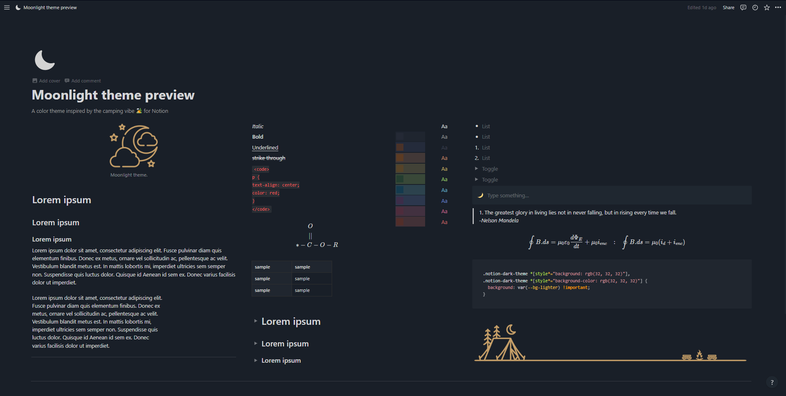

    

 
<h2 align="center"> <b>Themes </b> </h2>

"Moonlight Notion" 🏕

 

  

<h2 style="display: flex; flex-direction: row; justify-content: start;">  Description</h2>

A simple @moonlight-theme for notion 🏕

### Theme Colors

| Variable     | Hex        | Elements                       |
| ------------ | ---------- | ------------------------------ |
  --bg         | #191f28    | Page background                |
  --bg-light   | #1f2730e6  |                                |
  --bg-lighter | #1f2730    | SideBar, Popup, CollectionView |
  --fg         | #c0cedde6  | Text                           |
  --fg-light   | #c0cedd99  | TOC                            |
  --fg-lighter | #99a0a838  | SVG, lighter text              |
  --main       | #c69f68    | Buttons, Calendar              |
  --hover      | #c69f6854  | SideBar items                  |
  --border     |--bg-lighter| Table, Collection Views        |
  --selection  | #3746568a  | Selection                      |
  --gray       | #374656    | Text, Quotes                   |
  --brown      | #3e4152    | Text, Quotes                   |
  --orange     | #c68768    | Text, Quotes                   |
  --yellow     | #c6af68    | Text, Quotes                   |
  --green      | #9fc76d    | Text, Quotes                   |
  --blue       | #68aec6    | Text, Quotes                   |
  --purple     | #6880c6    | Text, Quotes                   |
  --pink       | #c66890    | Text, Quotes                   |
  --red        | #c66868    | Text, Quotes                   |
  --bg-gray    | #3437463D  | Text, blocks, tags background  |
  --bg-brown   | #4650793D  | Text, blocks, tags background  |
  --bg-orange  | #c687683D  | Text, blocks, tags background  |
  --bg-yellow  | #c6af683D  | Text, blocks, tags background  |
  --bg-green   | #9fc76d3D  | Text, blocks, tags background  |
  --bg-blue    | #68aec63D  | Text, blocks, tags background  |
  --bg-purple  | #6880c63D  | Text, blocks, tags background  |
  --bg-pink    | #c668903D  | Text, blocks, tags background  |
  --bg-red     | #c668683D  | Text, blocks, tags background  |

